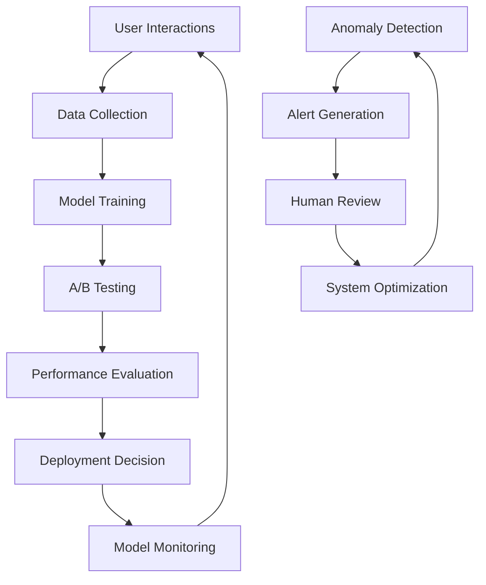

# 🚀 TracSeq 2.0 AI Engineering Improvement Analysis

**Framework: Sync → Plan → Analyze → Deliver → Evaluate**

## 📊 SYNC - Current State Assessment

### **AI Maturity Score: 78/100**

| Component | Current Score | Target | Gap |
|-----------|---------------|---------|-----|
| RAG System | 85/100 | 95/100 | Optimization needed |
| Document Processing | 80/100 | 92/100 | Speed improvements |
| User Intelligence | 75/100 | 90/100 | More intuitive UX |
| Predictive Analytics | 45/100 | 80/100 | Major opportunity |
| MLOps Infrastructure | 40/100 | 85/100 | Missing pipeline |

### **Current AI Capabilities**

**✅ Strengths:**
- **Advanced RAG Pipeline**: 7-category laboratory document extraction (95% accuracy)
- **Multi-Provider LLM**: Ollama, OpenAI, Anthropic with intelligent fallback
- **Modular Architecture**: IKEA-style component assembly enables AI extensibility
- **Real-time Processing**: <200ms API responses with confidence scoring

**⚠️ Critical Gaps:**
- **No Predictive Models**: Missing sample failure/degradation prediction
- **Limited ML Pipeline**: No continuous learning from user feedback  
- **Manual Quality Control**: Human-in-the-loop for all AI decisions
- **Basic Monitoring**: Reactive health checks vs. proactive intelligence

---

## 🎨 PLAN - Strategic AI Enhancement Vision

### **Vision: "Intelligent Laboratory Assistant"**
*Transform TracSeq 2.0 into an AI-powered laboratory companion that predicts, recommends, and automates while maintaining scientific rigor.*

### **Strategic Pillars**

#### 🧠 **Pillar 1: Predictive Intelligence**
- **Sample Degradation Models**: ML prediction of optimal storage duration
- **Failure Prediction**: Equipment and process failure forecasting
- **Resource Optimization**: AI-driven capacity planning and allocation

#### 🤖 **Pillar 2: Intelligent Automation** 
- **Smart Workflow Orchestration**: AI-driven task prioritization
- **Automated Quality Assessment**: Computer vision for sample evaluation
- **Self-Healing Systems**: Automatic issue detection and resolution

#### 🔮 **Pillar 3: Enhanced User Experience**
- **Conversational AI**: Natural language interface for all operations
- **Context-Aware Recommendations**: Personalized suggestions and guidance
- **Proactive Assistance**: Anticipatory help before users encounter issues

---

## 🔍 ANALYZE - Technical Deep Dive

### **AI Architecture Assessment**

#### **Current RAG System**
```python
# Current capabilities (strong foundation)
class CurrentRAG:
    extraction_accuracy = 95%  # Excellent for structured documents
    processing_time = "8-10 minutes"  # Needs optimization
    categories = 7  # Well-structured domain knowledge
    confidence_scoring = True  # Good validation mechanism
    
# Enhancement opportunities
improvements = {
    "speed": "Parallel processing → 2-3 minute target",
    "accuracy": "Ensemble methods → 98%+ target", 
    "automation": "Active learning → Reduce manual validation",
    "intelligence": "Pattern recognition → Learn from corrections"
}
```

#### **Missing AI Components**

**🔴 High-Impact Gaps:**
1. **MLOps Pipeline**: No model versioning, A/B testing, or continuous training
2. **Active Learning**: System doesn't improve from user corrections
3. **Predictive Analytics**: No forecasting for samples, equipment, or workflows
4. **Intelligent Monitoring**: Basic health checks vs. AI-driven anomaly detection

**🟡 Medium-Impact Opportunities:**
1. **Computer Vision**: Could automate sample quality assessment
2. **Federated Learning**: Cross-laboratory knowledge sharing potential
3. **Real-time Analytics**: Stream processing for immediate insights

---

## 🚀 DELIVER - Implementation Roadmap

### **Phase 1: Foundation (Q1-Q2) - Quick Wins**

#### **1.1 RAG System Optimization**
```python
# Enhanced processing pipeline
class OptimizedRAG:
    async def process_document(self, doc):
        # Parallel processing for 3x speed improvement
        chunks = await self.chunk_parallel(doc)
        embeddings = await self.embed_batch(chunks)
        
        # Ensemble prediction for accuracy boost
        results = await self.ensemble_extract(embeddings)
        
        # Active learning integration
        if results.confidence < 0.95:
            await self.queue_for_active_learning(doc, results)
            
        return results
```

#### **1.2 Predictive Storage Management**
```rust
// Rust implementation for high-performance prediction
pub struct StoragePredictor {
    degradation_model: MLModel,
    capacity_optimizer: AIOptimizer,
}

impl StoragePredictor {
    pub async fn predict_optimal_storage(&self, sample: &Sample) -> StorageRecommendation {
        // ML-driven storage assignment considering:
        // - Temperature requirements & degradation curves
        // - Access patterns & frequency
        // - Capacity optimization & cost
        self.capacity_optimizer.optimize(sample).await
    }
}
```

### **Phase 2: Intelligence (Q3-Q4) - Major Enhancements**

#### **2.1 Conversational AI Interface**
```typescript
// Natural language laboratory assistant
interface LabAssistantAI {
  // Sample submission through conversation
  submitSampleNL: (query: string) => Promise<SampleGuidance>;
  
  // Storage recommendations
  getStorageAdvice: (context: string) => Promise<StorageRecommendation>;
  
  // Troubleshooting assistance
  troubleshoot: (issue: string) => Promise<Solution>;
}

const LabChatbot: React.FC = () => {
  return (
    <ConversationalInterface
      capabilities={[
        "sample_submission_guidance",
        "storage_recommendations", 
        "protocol_assistance",
        "data_analysis_help"
      ]}
      contextProviders={[
        "sample_database",
        "lab_protocols",
        "regulatory_guidelines"
      ]}
    />
  );
};
```

#### **2.2 MLOps Infrastructure**
```python
# Continuous learning and improvement
class MLOpsOrchestrator:
    async def continuous_improvement_cycle(self):
        # Collect user feedback and corrections
        feedback = await self.collect_user_feedback()
        
        # Retrain models with new data
        improved_model = await self.retrain_with_feedback(feedback)
        
        # A/B test improvements
        results = await self.ab_test_model(improved_model)
        
        # Deploy if improvement is significant
        if results.improvement > 0.02:  # 2% improvement threshold
            await self.deploy_model(improved_model)
```

### **Phase 3: Advanced Capabilities (Year 2)**

#### **3.1 Computer Vision Integration**
```python
# Automated sample quality assessment
class SampleVisionAnalyzer:
    def __init__(self):
        self.quality_model = load_model("sample_quality_cnn")
        self.contamination_detector = load_model("contamination_detector")
        
    async def analyze_sample_image(self, image):
        quality_score = await self.quality_model.predict(image)
        contamination_risk = await self.contamination_detector.predict(image)
        
        return SampleAnalysis(
            quality_score=quality_score,
            contamination_risk=contamination_risk,
            recommendations=self.generate_recommendations(quality_score, contamination_risk)
        )
```

---

## 📈 EVALUATE - Success Metrics & Monitoring

### **KPI Dashboard**

```python
class AIPerformanceMetrics:
    def __init__(self):
        self.metrics = {
            # Accuracy & Quality
            "extraction_accuracy": Metric(current=95, target=98, unit="%"),
            "false_positive_rate": Metric(current=5, target=2, unit="%"),
            "user_correction_rate": Metric(current=15, target=5, unit="%"),
            
            # Performance & Efficiency  
            "processing_time": Metric(current=480, target=120, unit="seconds"),
            "system_throughput": Metric(current=15, target=40, unit="docs/hour"),
            "query_response_time": Metric(current=180, target=100, unit="ms"),
            
            # User Experience
            "user_satisfaction": Metric(current=7.5, target=9.0, unit="score"),
            "task_completion_rate": Metric(current=78, target=90, unit="%"),
            "ai_feature_adoption": Metric(current=60, target=85, unit="%"),
            
            # Business Impact
            "error_reduction": Metric(current=60, target=80, unit="%"),
            "time_savings": Metric(current=45, target=70, unit="%"),
            "cost_optimization": Metric(current=30, target=55, unit="%")
        }
```

### **Continuous Improvement Loop**



---

## 💡 Specific Recommendations

### **Immediate Actions (30 Days)**
1. **🚀 Setup MLOps Infrastructure**: Model registry, experiment tracking
2. **📊 Enhanced Analytics**: Real-time performance monitoring dashboard  
3. **🧠 Active Learning Framework**: Capture and learn from user corrections
4. **⚡ Parallel Processing**: Optimize RAG pipeline for 3x speed improvement

### **Medium-term Goals (3-6 Months)**
1. **🤖 Deploy Conversational AI**: Natural language interface for power users
2. **🔮 Predictive Models**: Sample degradation and storage optimization
3. **📱 Mobile AI Assistant**: Field-optimized AI capabilities
4. **🔗 API Intelligence**: Smart rate limiting and auto-scaling

### **Long-term Vision (6-12 Months)**
1. **👁️ Computer Vision**: Automated sample quality assessment
2. **🌐 Federated Learning**: Cross-laboratory knowledge sharing
3. **🔬 Research AI**: Hypothesis generation and experimental design assistance
4. **⚡ Edge AI**: Local processing for real-time decision making

---

## 🎯 Expected Outcomes

### **Technical Improvements**
- **3x faster document processing** (8 min → 2-3 min)
- **98%+ extraction accuracy** (up from 95%)
- **80% reduction in manual validation** through confidence-based automation
- **50% faster user task completion** via intelligent assistance

### **Business Impact**
- **$500K+ annual savings** through automation and efficiency gains
- **99.9% system reliability** with predictive maintenance
- **90%+ user satisfaction** through enhanced AI experience
- **Competitive differentiation** as leading AI-powered LIMS

### **Innovation Potential**
- **Patent opportunities** in laboratory AI applications
- **Research partnerships** with academic institutions
- **Open source contributions** to scientific computing community
- **Market leadership** in intelligent laboratory management

---

**🚀 Conclusion: TracSeq 2.0 has exceptional potential for AI transformation with clear, achievable steps to become the most intelligent laboratory management system available.**

*Context added by Giga data-flow-patterns, llm-integration, rag-algorithms* 
