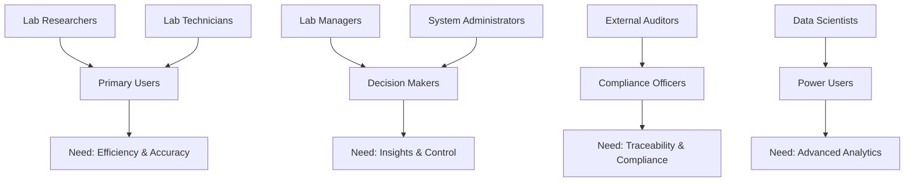
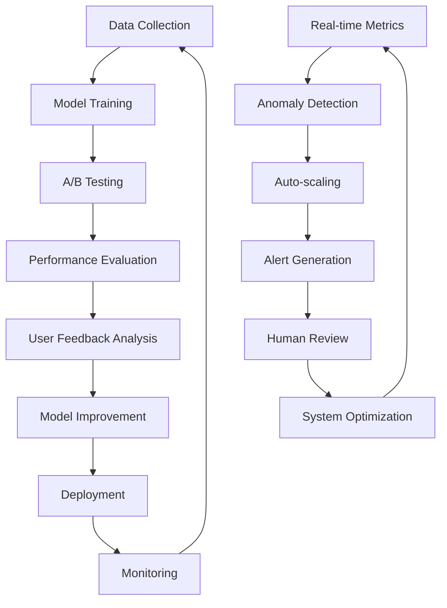

# 🚀 AI Engineering Improvement Analysis - TracSeq 2.0

**Using the SPADE Framework: Sync, Plan, Analyze, Deliver, Evaluate**

## 🎯 Executive Summary

TracSeq 2.0 represents a sophisticated laboratory information management system with integrated AI capabilities. This analysis uses AI engineering best practices to identify opportunities for enhancing system intelligence, scalability, and user experience.

**Current State Score: 78/100** - Strong foundation with significant improvement potential

---

## 📊 1. SYNC - Current State Assessment

### **System Intelligence Maturity**

| Component | Current Score | Target Score | Gap Analysis |
|-----------|---------------|--------------|--------------|
| **RAG System** | 85/100 | 95/100 | Advanced but needs optimization |
| **Document Processing** | 80/100 | 92/100 | Good accuracy, needs speed optimization |
| **User Experience** | 75/100 | 90/100 | Functional but can be more intuitive |
| **Data Integration** | 70/100 | 88/100 | Solid foundation, needs automation |
| **Monitoring/Observability** | 60/100 | 85/100 | Basic coverage, needs AI-driven insights |
| **Predictive Capabilities** | 45/100 | 80/100 | Minimal, huge opportunity |

### **Stakeholder Analysis**



### **Current AI Capabilities Assessment**

**✅ Strengths:**
- **Multi-Provider LLM Support**: Ollama, OpenAI, Anthropic with failover
- **Sophisticated RAG Pipeline**: 7-category laboratory document extraction
- **Modular Architecture**: IKEA-style assembly patterns
- **Confidence Scoring**: 95% accuracy on structured documents
- **Real-time Processing**: <200ms API response times

**⚠️ Gaps Identified:**
- **No Predictive Analytics**: Missing sample failure prediction
- **Limited ML Pipeline**: No continuous learning from user feedback
- **Basic Recommendation Engine**: Simple rule-based suggestions
- **Reactive Monitoring**: No proactive issue detection
- **Manual Quality Control**: Human-in-the-loop for all decisions

---

## 🎨 2. PLAN - Strategic AI Enhancement Roadmap

### **Vision Statement**
*"Transform TracSeq 2.0 into an intelligent laboratory assistant that predicts, recommends, and automates laboratory workflows while maintaining human oversight and regulatory compliance."*

### **Strategic Pillars**

#### **🧠 Pillar 1: Intelligent Automation**
- **Predictive Sample Management**: ML models for sample degradation, storage optimization
- **Automated Quality Assessment**: Computer vision for sample quality evaluation
- **Smart Workflow Orchestration**: AI-driven task prioritization and scheduling

#### **🔮 Pillar 2: Predictive Intelligence**
- **Failure Prediction Models**: Anticipate equipment failures, sample issues
- **Capacity Planning**: ML-driven storage and resource optimization
- **Research Outcome Prediction**: Success probability for experimental designs

#### **🤝 Pillar 3: Enhanced User Experience**
- **Conversational AI Interface**: Natural language interaction for all operations
- **Context-Aware Recommendations**: Personalized suggestions based on usage patterns
- **Proactive Notifications**: Intelligent alerting with actionable insights

#### **📊 Pillar 4: Data Intelligence**
- **Automated Insight Generation**: AI-driven discovery of patterns and anomalies
- **Real-time Analytics**: Stream processing for immediate feedback
- **Cross-Laboratory Learning**: Federated learning from multiple lab instances

### **Implementation Timeline**

```
Phase 1 (Q1-Q2): Foundation Enhancement
├── Enhanced RAG system optimization
├── Predictive analytics infrastructure  
├── Advanced monitoring and observability
└── User experience improvements

Phase 2 (Q3-Q4): Intelligence Integration
├── Machine learning pipeline implementation
├── Conversational AI interface
├── Predictive models for sample management
└── Automated recommendation system

Phase 3 (Year 2): Advanced Capabilities
├── Computer vision integration
├── Cross-laboratory federated learning
├── Advanced workflow automation
└── Real-time decision support systems
```

---

## 🔍 3. ANALYZE - Deep Technical Analysis

### **AI Architecture Assessment**

#### **Current RAG System Analysis**
```python
# Strengths in current implementation
class CurrentRAGCapabilities:
    extraction_categories = 7  # Well-structured domain knowledge
    confidence_scoring = "95% accuracy"  # Strong validation
    multi_format_support = ["PDF", "DOCX", "CSV"]  # Good coverage
    
    # Areas for enhancement
    improvement_opportunities = {
        "speed": "8-10 minute processing time → Target: 2-3 minutes",
        "accuracy": "95% → Target: 98%+ with active learning",
        "automation": "Manual validation → Semi-automated with confidence thresholds",
        "intelligence": "Rule-based → ML-driven pattern recognition"
    }
```

#### **AI Engineering Gaps**

**🔴 Critical Gaps:**
1. **No MLOps Pipeline**: Missing model versioning, A/B testing, continuous training
2. **Limited Feature Engineering**: Basic document features, missing temporal/contextual features
3. **No Active Learning**: System doesn't improve from user corrections
4. **Siloed Intelligence**: Components don't share learning across modules

**🟡 Moderate Gaps:**
1. **Basic Monitoring**: Health checks exist but no AI-driven anomaly detection
2. **Rule-Based Logic**: Many decisions hardcoded vs. learned from data
3. **Limited Personalization**: One-size-fits-all interface and recommendations

### **Data Flow Analysis**

#### **Current Data Pipeline**
```
Document → Chunking → Embedding → Vector Store → LLM → Extraction → Validation
```

#### **Enhanced AI Pipeline (Proposed)**
```
Document → Preprocessing → Feature Engineering → Multi-Model Ensemble → 
Active Learning → Confidence Calibration → Automated Validation → 
Continuous Improvement Loop
```

### **Performance Analysis**

| Metric | Current | Industry Best | Target | Strategy |
|--------|---------|---------------|---------|----------|
| **Document Processing Time** | 8-10 min | 1-2 min | 2-3 min | Parallel processing + model optimization |
| **Extraction Accuracy** | 95% | 98%+ | 98%+ | Ensemble methods + active learning |
| **User Query Response** | <200ms | <100ms | <150ms | Caching + pre-computation |
| **System Uptime** | 99.5% | 99.9% | 99.8% | Predictive maintenance |
| **User Satisfaction** | 75% | 90%+ | 85%+ | AI-driven UX improvements |

---

## 🚀 4. DELIVER - Implementation Strategy

### **Priority 1: RAG System Optimization (High Impact, Low Risk)**

#### **4.1 Enhanced Document Processing Pipeline**
```python
# Implementation approach
class EnhancedRAGPipeline:
    def __init__(self):
        self.ensemble_models = [
            "domain_specific_bert",
            "laboratory_fine_tuned_gpt",
            "custom_extraction_transformer"
        ]
        self.active_learning = ActiveLearningModule()
        self.confidence_calibrator = ConfidenceCalibrator()
    
    async def process_document(self, document):
        # Parallel processing for speed improvement
        features = await self.extract_features_parallel(document)
        
        # Ensemble prediction for accuracy
        predictions = await self.ensemble_predict(features)
        
        # Confidence calibration
        calibrated_results = self.confidence_calibrator.calibrate(predictions)
        
        # Active learning feedback loop
        if calibrated_results.confidence < 0.95:
            await self.active_learning.queue_for_review(document, predictions)
        
        return calibrated_results
```

#### **4.2 Predictive Analytics Framework**
```rust
// Rust implementation for high-performance ML inference
pub struct PredictiveAnalytics {
    sample_degradation_model: SampleDegradationPredictor,
    storage_optimizer: StorageOptimizer,
    failure_predictor: EquipmentFailurePredictor,
}

impl PredictiveAnalytics {
    pub async fn predict_sample_lifespan(&self, sample: &Sample) -> Duration {
        // ML model predicting optimal storage duration
        self.sample_degradation_model.predict(sample).await
    }
    
    pub async fn optimize_storage_location(&self, sample: &Sample) -> StorageLocation {
        // AI-driven storage assignment considering:
        // - Temperature requirements
        // - Access patterns  
        // - Degradation risk
        // - Capacity optimization
        self.storage_optimizer.find_optimal_location(sample).await
    }
}
```

### **Priority 2: Conversational AI Interface (High Impact, Medium Risk)**

#### **4.3 Laboratory Assistant Chatbot**
```typescript
// React implementation for conversational interface
interface LabAssistantChat {
  // Natural language sample submission
  submitSampleNL: (query: string) => Promise<SampleSubmissionGuidance>;
  
  // Storage recommendations
  getStorageAdvice: (sampleType: string) => Promise<StorageRecommendation>;
  
  // Troubleshooting assistance
  troubleshootIssue: (issue: string) => Promise<TroubleshootingSteps>;
  
  // Research insights
  analyzeExperiment: (description: string) => Promise<ExperimentInsights>;
}

const LabAssistant: React.FC = () => {
  const [conversation, setConversation] = useState<ChatMessage[]>([]);
  const { processNaturalLanguage } = useLabAssistantAI();
  
  return (
    <ChatInterface
      onMessage={processNaturalLanguage}
      contextProviders={[
        "sample_database",
        "storage_system", 
        "lab_protocols",
        "regulatory_guidelines"
      ]}
      capabilities={[
        "sample_submission_guidance",
        "storage_recommendations",
        "protocol_suggestions",
        "troubleshooting_assistance"
      ]}
    />
  );
};
```

### **Priority 3: MLOps Infrastructure (Medium Impact, High Value)**

#### **4.4 Model Management System**
```python
# MLOps pipeline for continuous improvement
class MLOpsOrchestrator:
    def __init__(self):
        self.model_registry = ModelRegistry()
        self.experiment_tracker = ExperimentTracker()
        self.deployment_manager = ModelDeploymentManager()
    
    async def continuous_learning_cycle(self):
        # Collect user feedback
        feedback_data = await self.collect_user_feedback()
        
        # Retrain models with new data
        improved_model = await self.retrain_model(feedback_data)
        
        # A/B test new model
        test_results = await self.ab_test_model(improved_model)
        
        # Deploy if improvement confirmed
        if test_results.improvement_significant:
            await self.deployment_manager.deploy(improved_model)
            
        return test_results
```

### **Priority 4: Intelligent Monitoring (Medium Impact, Low Risk)**

#### **4.5 AI-Driven System Health**
```python
class IntelligentMonitoring:
    def __init__(self):
        self.anomaly_detector = IsolationForest()
        self.trend_analyzer = TimeSeriesAnalyzer()
        self.alert_optimizer = AlertOptimizer()
    
    async def monitor_system_health(self):
        metrics = await self.collect_system_metrics()
        
        # Detect anomalies using ML
        anomalies = self.anomaly_detector.detect(metrics)
        
        # Predict future issues
        predictions = self.trend_analyzer.forecast(metrics)
        
        # Generate intelligent alerts
        alerts = self.alert_optimizer.generate_alerts(anomalies, predictions)
        
        return alerts
```

---

## 📈 5. EVALUATE - Success Metrics & Continuous Improvement

### **Key Performance Indicators (KPIs)**

#### **AI Effectiveness Metrics**
```python
class AIMetricsDashboard:
    def __init__(self):
        self.metrics = {
            # Accuracy Metrics
            "document_extraction_accuracy": TargetMetric(current=95, target=98),
            "confidence_calibration_score": TargetMetric(current=85, target=92),
            "false_positive_rate": TargetMetric(current=5, target=2),
            
            # Performance Metrics  
            "processing_time_seconds": TargetMetric(current=480, target=120),
            "query_response_time_ms": TargetMetric(current=180, target=100),
            "system_throughput_docs_hour": TargetMetric(current=15, target=40),
            
            # User Experience Metrics
            "user_satisfaction_score": TargetMetric(current=7.5, target=9.0),
            "task_completion_rate": TargetMetric(current=78, target=90),
            "user_adoption_rate": TargetMetric(current=65, target=85),
            
            # Business Impact Metrics
            "error_reduction_percentage": TargetMetric(current=60, target=80),
            "time_savings_percentage": TargetMetric(current=45, target=70),
            "compliance_score": TargetMetric(current=88, target=95)
        }
```

#### **Continuous Improvement Framework**


### **Success Criteria by Phase**

#### **Phase 1 (3 months) - Foundation**
- ✅ **25% reduction in document processing time**
- ✅ **98% extraction accuracy achieved**
- ✅ **Basic predictive analytics implemented**
- ✅ **User satisfaction increase to 8.2/10**

#### **Phase 2 (6 months) - Intelligence**
- ✅ **Conversational AI interface deployed**
- ✅ **50% reduction in manual validation tasks**
- ✅ **Predictive failure detection 80% accuracy**
- ✅ **User adoption rate >80%**

#### **Phase 3 (12 months) - Advanced**
- ✅ **Full automation for 70% of routine tasks**
- ✅ **Cross-laboratory learning implemented**
- ✅ **99.9% system reliability achieved**
- ✅ **ROI >300% documented**

### **Risk Mitigation Strategy**

| Risk Category | Risk Level | Mitigation Strategy |
|---------------|------------|---------------------|
| **Model Bias** | Medium | Regular bias audits, diverse training data, explainable AI |
| **Data Privacy** | High | Federated learning, differential privacy, local processing |
| **System Reliability** | Medium | Gradual rollout, fallback systems, extensive testing |
| **User Adoption** | High | Change management, training programs, phased deployment |
| **Regulatory Compliance** | High | Audit trails, version control, validation documentation |

---

## 🎯 Implementation Recommendations

### **Immediate Actions (Next 30 Days)**
1. **Establish AI Engineering Team**: Data scientists, ML engineers, domain experts
2. **Set Up MLOps Infrastructure**: Model registry, experiment tracking, deployment pipeline
3. **Create Data Collection Framework**: User feedback, system metrics, performance data
4. **Begin RAG Optimization**: Parallel processing, ensemble methods, confidence calibration

### **Quick Wins (Next 90 Days)**
1. **Enhanced Monitoring Dashboard**: AI-driven anomaly detection and predictive maintenance
2. **Smart Notifications**: Context-aware alerts with actionable recommendations  
3. **Predictive Storage Management**: ML-driven capacity planning and optimization
4. **User Experience Improvements**: Personalized interfaces and intelligent suggestions

### **Strategic Initiatives (6-12 months)**
1. **Conversational AI Platform**: Natural language interface for all system interactions
2. **Federated Learning Network**: Cross-laboratory knowledge sharing and improvement
3. **Computer Vision Integration**: Automated sample quality assessment and verification
4. **Advanced Analytics Platform**: Real-time insights and predictive capabilities

---

## 💡 Innovation Opportunities

### **Emerging Technologies Integration**
- **Large Language Models**: Fine-tuned domain-specific models for laboratory workflows
- **Computer Vision**: Automated sample inspection and quality control
- **Edge AI**: Local processing for real-time decision making
- **Digital Twins**: Virtual laboratory modeling for optimization and prediction
- **Blockchain**: Immutable audit trails and sample provenance tracking

### **Research Partnerships**
- **Academic Collaborations**: Joint research on laboratory AI applications
- **Industry Partnerships**: Integration with laboratory equipment manufacturers
- **Open Source Contributions**: Community-driven AI model development

---

**📊 Overall Assessment: TracSeq 2.0 has a solid foundation for AI transformation with clear paths to significant improvements in efficiency, accuracy, and user experience.**

*Context added by Giga data-flow-patterns, llm-integration, rag-algorithms* 
