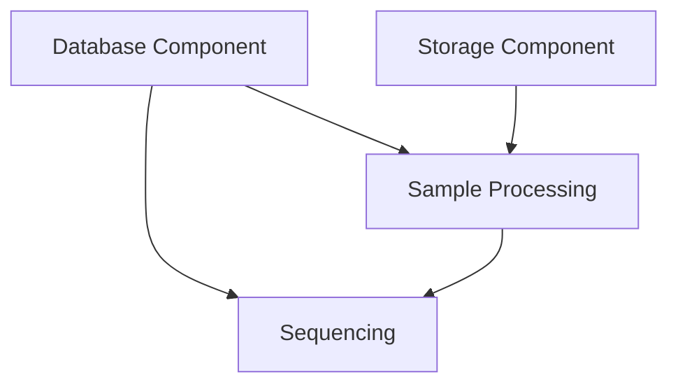

# Lab Manager Component Guide

## Overview
This guide explains how to assemble and use the Lab Manager components in an IKEA-like fashion. Each component is designed to be self-contained and can be assembled independently.

## Components

### 1. Database Component
The database component handles all database operations and migrations.

```rust
let database = DatabaseComponent {
    pool: create_pool(&database_url).await?
};
```

### 2. Storage Component
Manages sample storage with barcode tracking.

```rust
let storage = StorageComponent {
    storage: Arc::new(Storage::new(storage_path))
};
```

### 3. Sample Processing Component
Handles sample submissions and validation.

```rust
let sample_processing = SampleProcessingComponent {
    manager: Arc::new(SampleSubmissionManager::new(pool.clone()))
};
```

### 4. Sequencing Component
Manages sequencing jobs and their lifecycle.

```rust
let sequencing = SequencingComponent {
    manager: Arc::new(SequencingManager::new(pool.clone()))
};
```

## Assembly Instructions

1. **Prerequisites**
   - Set up environment variables (DATABASE_URL, STORAGE_PATH)
   - Install required dependencies

2. **Basic Assembly**
   ```rust
   let components = AppComponents::assemble().await?;
   ```

3. **Custom Assembly**
   ```rust
   let components = AppComponents {
       database: DatabaseComponent::new().await?,
       storage: StorageComponent::new()?,
       sample_processing: SampleProcessingComponent::new(pool.clone()),
       sequencing: SequencingComponent::new(pool.clone()),
   };
   ```

## Component Dependencies



## Best Practices

1. **Error Handling**
   - Use the Result type for component initialization
   - Handle errors at the component level

2. **Configuration**
   - Keep component configuration separate
   - Use environment variables for sensitive data

3. **Testing**
   - Test components independently
   - Use mock implementations for dependencies

## Troubleshooting

Common issues and solutions:

1. **Database Connection Issues**
   - Check DATABASE_URL format
   - Verify network connectivity

2. **Storage Path Problems**
   - Ensure STORAGE_PATH exists
   - Check permissions

3. **Component Initialization Failures**
   - Verify all dependencies are available
   - Check component logs

## Extending Components

To add new functionality:

1. Create a new component struct
2. Implement required traits
3. Add to AppComponents
4. Update assembly logic

## Security Considerations

1. **Database Security**
   - Use connection pooling
   - Implement proper access controls

2. **Storage Security**
   - Validate file paths
   - Implement access controls

3. **API Security**
   - Use proper authentication
   - Validate all inputs 
