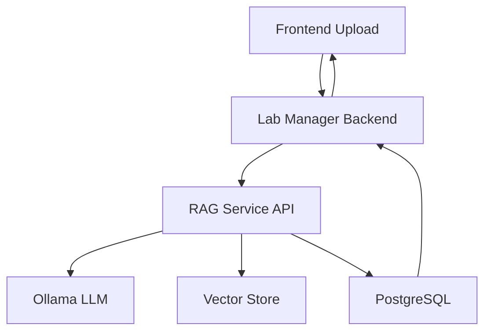

# TracSeq 2.0 Docker Integration Guide

## 🎯 **Complete Docker Integration Solution**

This guide provides a unified Docker setup that ensures seamless communication between the RAG system and Lab Manager through properly configured containers and networking.

## 📋 **What's Been Fixed**

### **Before (Issues):**
❌ RAG and Lab Manager in separate Docker networks  
❌ Service discovery problems with `host.docker.internal`  
❌ Database connection conflicts  
❌ Manual coordination required  
❌ Complex startup process  

### **After (Solutions):**
✅ **Unified Docker Compose** with single network  
✅ **Proper service discovery** using container names  
✅ **Shared PostgreSQL database** with table prefixes  
✅ **Automated startup** with dependency management  
✅ **Comprehensive health checks** and integration tests  

## 🚀 **Quick Start**

### **1. Start the Unified System**
```powershell
# Development mode (hot reload, port 5173)
.\start-unified.ps1 dev

# Production mode (optimized, port 8080)  
.\start-unified.ps1 prod
```

### **2. Test Integration**
```powershell
# Run comprehensive integration tests
.\test-integration.ps1
```

### **3. Access Services**
- **Frontend:** http://localhost:5173 (dev) or http://localhost:8080 (prod)
- **Lab Manager API:** http://localhost:3000 (dev) or http://localhost:3001 (prod)
- **RAG Service:** http://localhost:8000
- **Database:** localhost:5433
- **Ollama:** http://localhost:11434

## 🏗️ **Architecture Overview**

```
┌─────────────────────────────────────────────────────────────┐
│                     TracSeq Network                        │
│                    (172.20.0.0/16)                        │
│                                                            │
│  ┌──────────────┐  ┌──────────────┐  ┌─────────────────┐  │
│  │   Frontend   │  │ Lab Manager  │  │   RAG Service   │  │
│  │  (5173/8080) │  │ (3000/3001)  │  │     (8000)      │  │
│  └──────────────┘  └──────────────┘  └─────────────────┘  │
│         │                   │                   │         │
│         └───────────────────┼───────────────────┘         │
│                             │                             │
│  ┌──────────────┐  ┌──────────────┐  ┌─────────────────┐  │
│  │  PostgreSQL  │  │    Ollama    │  │   (Volumes)     │  │
│  │    (5433)    │  │   (11434)    │  │   Storage       │  │
│  └──────────────┘  └──────────────┘  └─────────────────┘  │
└─────────────────────────────────────────────────────────────┘
```

## 📁 **File Structure**

```
tracseq2.0/
├── docker-compose.unified.yml     # ✨ NEW: Unified orchestration
├── tracseq.env                    # ✨ NEW: Environment config
├── start-unified.ps1              # ✨ NEW: Easy startup script  
├── test-integration.ps1           # ✨ NEW: Integration tests
├── DOCKER_INTEGRATION_GUIDE.md    # ✨ NEW: This guide
├── 
├── lab_manager/                   # Lab Manager system
│   ├── docker-compose.yml         # 🔄 Original (still works)
│   └── ...
├── 
└── lab_submission_rag/            # RAG system  
    ├── docker-compose.yml         # 🔄 Original (still works)
    └── ...
```

## ⚙️ **Configuration Details**

### **Environment Variables**

The `tracseq.env` file configures both systems:

```bash
# Database (Shared)
POSTGRES_DB=lab_manager
POSTGRES_USER=postgres
POSTGRES_PASSWORD=postgres

# Service Ports
BACKEND_DEV_PORT=3000
FRONTEND_DEV_PORT=5173
RAG_SERVICE_PORT=8000

# LLM Configuration
USE_OLLAMA=true
OLLAMA_MODEL=llama3.2:3b
OPENAI_API_KEY=your_key_here

# RAG Integration
RAG_ENABLED=true
RAG_CONFIDENCE_THRESHOLD=0.7
```

### **Service Discovery**

Services communicate using container names:

- **Lab Manager → RAG:** `http://rag-service:8000`
- **RAG → Database:** `postgres:5432`
- **Frontend → Backend:** `http://lab-manager-dev:3000`

### **Database Integration**

- **Shared PostgreSQL** instance for both systems
- **Table prefixes** prevent conflicts (`rag_` for RAG tables)
- **Automatic migration** on startup

## 🔧 **Advanced Usage**

### **Manual Docker Commands**

```bash
# Start specific services
docker-compose -f docker-compose.unified.yml up -d postgres ollama

# View logs
docker-compose -f docker-compose.unified.yml logs -f rag-service

# Check service status
docker-compose -f docker-compose.unified.yml ps

# Stop everything
docker-compose -f docker-compose.unified.yml down
```

### **Development vs Production**

```bash
# Development (hot reload)
COMPOSE_PROFILES=dev .\start-unified.ps1 dev

# Production (optimized builds)
COMPOSE_PROFILES=production .\start-unified.ps1 prod
```

### **Scale Services**

```bash
# Scale RAG service for high load
docker-compose -f docker-compose.unified.yml up -d --scale rag-service=3
```

## 🧪 **Testing Integration**

### **Automated Tests**

```powershell
# Full integration test suite
.\test-integration.ps1

# Manual service verification
curl http://localhost:8000/health              # RAG Health
curl http://localhost:3000/health              # Lab Manager Health  
curl http://localhost:3000/api/samples/rag/status  # Integration Test
```

### **Test Scenarios**

1. **Document Upload:** Upload PDF → RAG processes → Lab Manager creates samples
2. **Query System:** Ask questions → RAG searches → Returns intelligent answers
3. **Database Sync:** Both systems read/write to shared database
4. **Error Handling:** Services gracefully handle failures

## 🔍 **Communication Flow**

### **Document Processing Workflow:**



### **API Endpoints:**

| Service | Endpoint | Purpose |
|---------|----------|---------|
| Lab Manager | `/api/samples/rag/process-document` | Process documents via RAG |
| Lab Manager | `/api/samples/rag/query` | Query RAG system |
| Lab Manager | `/api/samples/rag/status` | Check RAG integration |
| RAG Service | `/health` | Service health check |
| RAG Service | `/process` | Direct document processing |
| RAG Service | `/query` | Direct querying |

## 🛠️ **Troubleshooting**

### **Common Issues & Solutions**

#### **🔸 Services Won't Start**
```bash
# Check Docker status
docker info

# Verify required ports are free
netstat -an | findstr ":8000"
netstat -an | findstr ":5433"

# Clean up previous containers
docker-compose -f docker-compose.unified.yml down -v
```

#### **🔸 RAG-Lab Manager Communication Fails**
```bash
# Test internal network connectivity
docker exec tracseq_lab_manager_dev curl http://rag-service:8000/health

# Check container logs
docker logs tracseq_rag
docker logs tracseq_lab_manager_dev
```

#### **🔸 Database Connection Issues**
```bash
# Test database connectivity
docker exec tracseq_postgres pg_isready -U postgres

# Check database logs
docker logs tracseq_postgres
```

#### **🔸 Ollama Model Issues**
```bash
# Check model download status
docker exec tracseq_ollama ollama list

# Manually pull model
docker exec tracseq_ollama ollama pull llama3.2:3b
```

### **Health Check Commands**

```bash
# Quick health verification
curl http://localhost:8000/health              # RAG
curl http://localhost:3000/health              # Lab Manager
curl http://localhost:11434/api/version        # Ollama
docker exec tracseq_postgres pg_isready -U postgres  # Database
```

### **Log Analysis**

```bash
# View all logs
docker-compose -f docker-compose.unified.yml logs

# Service-specific logs
docker-compose -f docker-compose.unified.yml logs rag-service
docker-compose -f docker-compose.unified.yml logs lab-manager-dev

# Follow logs in real-time
docker-compose -f docker-compose.unified.yml logs -f
```

## 📊 **Performance Monitoring**

### **Resource Usage**

```bash
# Container resource usage
docker stats

# Database connections
docker exec tracseq_postgres psql -U postgres -d lab_manager -c "SELECT count(*) FROM pg_stat_activity;"

# RAG service metrics
curl http://localhost:8000/system-info
```

### **Optimization Tips**

1. **Allocate sufficient RAM** for Ollama (4GB minimum)
2. **Use SSD storage** for PostgreSQL volume
3. **Monitor container logs** for performance issues
4. **Scale RAG service** for high document processing loads

## 🔄 **Migration from Separate Systems**

### **If You're Currently Using Separate Docker Setups:**

```bash
# 1. Stop existing services
cd lab_manager && docker-compose down
cd lab_submission_rag && docker-compose down

# 2. Backup data (optional)
docker run --rm -v lab_manager_postgres_data:/data -v $(pwd):/backup ubuntu tar czf /backup/postgres_backup.tar.gz /data

# 3. Use unified setup
cd .. # back to root
.\start-unified.ps1 dev

# 4. Test integration
.\test-integration.ps1
```

## 🎉 **Success Indicators**

You'll know the integration is working when:

✅ **All services show healthy** in `.\test-integration.ps1`  
✅ **Frontend loads** at http://localhost:5173  
✅ **RAG submissions page** works at http://localhost:5173/rag-submissions  
✅ **Document upload** creates samples automatically  
✅ **Query system** provides intelligent answers  
✅ **No error logs** in Docker containers  

## 🚀 **Next Steps**

1. **Deploy to production** using the production profile
2. **Set up monitoring** with Prometheus/Grafana
3. **Configure SSL** for secure connections
4. **Implement backups** for PostgreSQL data
5. **Scale services** based on usage patterns

---

*Context added by Giga data-flow-patterns* 
