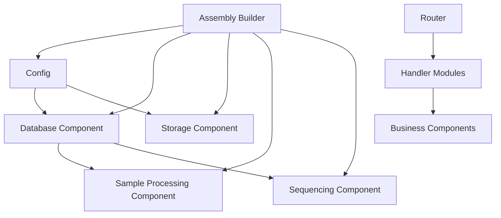

# IKEA-Style Modular Architecture

## Overview

The Lab Manager system is now designed with an IKEA-like philosophy: modular, democratic, and easy to assemble. Each component is independent, well-documented, and can be combined in different ways based on your needs.

## Core Principles

### 🧱 **Modularity**
- Each component has a single responsibility
- Components can be developed, tested, and deployed independently
- Clear interfaces between components

### 🗳️ **Democratic Design**
- No single component dominates the system
- Each component has equal voice in the architecture
- Easy to swap implementations without affecting others

### 🔧 **Configurable Assembly**
- Multiple assembly patterns for different use cases
- Builder patterns for complex configurations
- Environment-specific configurations

## Component Structure

```
src/
├── assembly/           # Component assembly and builders
├── config/            # Configuration management
├── handlers/          # HTTP handlers (modular by feature)
│   ├── dashboard/     # Dashboard endpoints
│   ├── samples/       # Sample management endpoints
│   ├── sequencing/    # Sequencing job endpoints
│   └── templates/     # Template management endpoints
├── router/            # Modular routing system
└── [business logic modules...]
```

## Assembly Patterns

### 1. Production Assembly
```rust
use assembly::assemble_production_components;

let components = assemble_production_components().await?;
```

### 2. Custom Assembly with Builder
```rust
use assembly::ComponentBuilder;
use config::AppConfig;

let config = AppConfig::from_env()?;
let components = ComponentBuilder::new(config)
    .with_database().await?
    .with_storage().await?
    .with_sample_processing()?
    .with_sequencing()?
    .build()?;
```

### 3. Selective Assembly
```rust
use assembly::CustomAssembly;

// API-only mode (no file storage)
let components = CustomAssembly::api_only(config).await?;

// Storage-only mode (no database)
let storage = CustomAssembly::storage_only(config).await?;
```

## Router Modularity

Routes are organized by feature and can be combined as needed:

```rust
use router::{health_routes, template_routes, sample_routes};

// Full application
let app = Router::new()
    .merge(health_routes())
    .merge(template_routes())
    .merge(sample_routes());

// Minimal API
let app = Router::new()
    .merge(health_routes())
    .merge(template_routes());
```

## Configuration Management

### Environment-based Configuration
```rust
let config = AppConfig::from_env()?;
```

### Test Configuration
```rust
let config = AppConfig::for_testing();
```

### Custom Configuration
```rust
let config = AppConfig {
    database: DatabaseConfig {
        url: "postgres://localhost/mydb".to_string(),
        max_connections: 10,
        min_connections: 1,
    },
    storage: StorageConfig {
        base_path: PathBuf::from("/data/storage"),
        max_file_size: 100 * 1024 * 1024,
        allowed_extensions: vec!["xlsx".to_string()],
    },
    server: ServerConfig {
        host: "0.0.0.0".to_string(),
        port: 8080,
        cors_enabled: true,
    },
};
```

## Deployment Scenarios

### Scenario 1: Full-Stack Deployment
```rust
#[tokio::main]
async fn main() {
    let components = assemble_production_components().await?;
    let app = create_app_router().with_state(components);
    // ... serve
}
```

### Scenario 2: Microservice Deployment
```rust
// Service A: Template Processing Only
let config = AppConfig::from_env()?;
let components = ComponentBuilder::new(config)
    .with_database().await?
    .with_storage().await?
    .build()?;

let app = template_routes().with_state(components);

// Service B: Sample Processing Only  
let components = ComponentBuilder::new(config)
    .with_database().await?
    .with_sample_processing()?
    .build()?;

let app = sample_routes().with_state(components);
```

### Scenario 3: Testing Setup
```rust
#[tokio::test]
async fn test_sample_creation() {
    let components = assemble_test_components().await?;
    let app = create_test_router().with_state(components);
    // ... test
}
```

## Component Dependencies



## Error Handling

Each assembly step has specific error types:

```rust
#[derive(Debug, thiserror::Error)]
pub enum AssemblyError {
    #[error("Configuration error: {0}")]
    Configuration(#[from] ConfigError),
    #[error("Database connection error: {0}")]
    DatabaseConnection(#[from] sqlx::Error),
    #[error("Missing dependency: {0}")]
    MissingDependency(&'static str),
    // ...
}
```

## Best Practices

### 1. Component Development
- Each component should be self-contained
- Use dependency injection for external dependencies
- Implement proper error handling
- Write component-specific tests

### 2. Assembly Development
- Always check dependencies before building components
- Provide meaningful error messages
- Use builder patterns for complex assemblies
- Document assembly requirements

### 3. Configuration Management
- Use environment variables for deployment-specific config
- Provide sensible defaults
- Validate configuration on startup
- Support different environments (dev, test, prod)

### 4. Testing Strategy
- Test components in isolation
- Test assembly patterns
- Use test-specific configurations
- Mock external dependencies

## Migration Guide

If you're migrating from the old monolithic setup:

1. **Update imports**: Use the new modular handler imports
2. **Update assembly**: Replace `AppComponents::assemble()` with `assemble_production_components()`
3. **Update routing**: Use the new router modules
4. **Update configuration**: Use the new config system

### Before
```rust
let components = AppComponents::assemble().await?;
let app = Router::new()
    .route("/health", get(handlers::health_check))
    // ... many routes
    .with_state(components);
```

### After
```rust
let components = assemble_production_components().await?;
let app = create_app_router().with_state(components);
```

## Future Extensibility

This architecture makes it easy to:

- Add new components without affecting existing ones
- Create new assembly patterns for different deployment needs
- Implement different storage backends
- Add new API versions
- Create component-specific optimizations

## Example: Adding a New Component

1. **Create the component**:
```rust
pub struct NotificationComponent {
    pub sender: Arc<NotificationSender>,
}
```

2. **Add to builder**:
```rust
impl ComponentBuilder {
    pub fn with_notifications(mut self) -> Result<Self, AssemblyError> {
        let sender = Arc::new(NotificationSender::new());
        self.notification = Some(sender);
        Ok(self)
    }
}
```

3. **Add routes**:
```rust
pub fn notification_routes() -> Router<AppComponents> {
    Router::new()
        .route("/api/notifications", get(handlers::list_notifications))
}
```

4. **Update assembly**:
```rust
ComponentBuilder::new(config)
    .with_database().await?
    .with_notifications()?
    .build()
```

This IKEA-like approach ensures that adding new functionality is as simple as adding a new piece to your furniture assembly!

*Context improved by Giga AI* 
