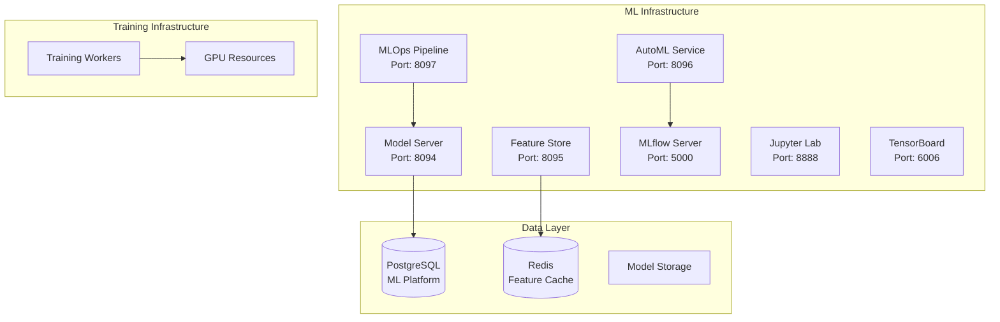

# Phase 8: Machine Learning Integration - Implementation Guide

## Overview

Phase 8 introduces a comprehensive Machine Learning platform for TracSeq 2.0, enabling intelligent predictions and optimizations throughout the laboratory workflow. This phase includes model serving, feature management, automated ML, and complete MLOps capabilities.

## Architecture

### ML Platform Components



## Components

### 1. Model Serving Infrastructure

**Location**: `ml-platform/model-serving/model_server.py`

**Features**:
- Real-time model predictions
- A/B testing support
- Model versioning
- Caching with Redis
- Prometheus metrics

**API Endpoints**:
```python
POST /predict          # Single prediction
POST /batch_predict    # Batch predictions
GET  /models/{type}    # Model information
GET  /health          # Health check
```

**Example Usage**:
```bash
# Make a prediction
curl -X POST http://localhost:8094/predict \
  -H "Content-Type: application/json" \
  -d '{
    "model_type": "sample_quality",
    "features": {
      "collection_time_hours": 12,
      "temperature_celsius": -78,
      "volume_ml": 5,
      "sample_type": "plasma"
    }
  }'
```

### 2. Feature Store

**Location**: `ml-platform/feature-store/feature_store.py`

**Capabilities**:
- Centralized feature management
- Real-time feature serving
- Feature versioning
- Computed features
- Time-travel queries

**Feature Types**:
- `sample_age_hours`: Computed from collection time
- `temperature_deviation`: Storage temperature analysis
- `quality_risk_score`: Composite quality metric
- `storage_utilization`: Capacity management
- `processing_delay_category`: Workflow optimization

**API Usage**:
```python
# Get features for an entity
POST /features
{
  "entity_type": "sample",
  "entity_id": "SAMPLE001",
  "features": ["sample_age_hours", "quality_risk_score"]
}

# Register new feature
POST /register-feature
{
  "name": "contamination_risk",
  "entity_type": "sample",
  "type": "numeric",
  "source": "computed"
}
```

### 3. AutoML Framework

**Location**: `ml-platform/automl/automl_framework.py`

**Features**:
- Automated model selection
- Hyperparameter optimization with Optuna
- Cross-validation
- Model comparison
- Automatic feature engineering

**Supported Models**:
- Logistic/Linear Regression
- Random Forest
- Gradient Boosting
- XGBoost
- LightGBM
- Neural Networks

**Running AutoML**:
```bash
# Start AutoML experiment
curl -X POST http://localhost:8096/experiments \
  -H "Content-Type: application/json" \
  -d '{
    "experiment_name": "sample_quality_v2",
    "dataset_path": "/data/sample_quality.csv",
    "target_column": "quality_score",
    "optimization_metric": "rmse",
    "time_budget_minutes": 60
  }'

# Check experiment status
curl http://localhost:8096/experiments/{experiment_id}
```

### 4. MLOps Pipeline

**Location**: `ml-platform/mlops/mlops_pipeline.py`

**Capabilities**:
- Experiment tracking
- Model registry
- Automated deployment
- Model promotion workflow
- A/B testing
- Rollback support

**Deployment Workflow**:
```python
# 1. Create experiment
POST /experiments
{
  "name": "quality_prediction_exp_001",
  "parameters": {"model_type": "xgboost"},
  "user_id": "data_scientist_1"
}

# 2. Register trained model
POST /models/register
{
  "run_id": "mlflow_run_id",
  "model_name": "sample_quality_predictor",
  "model_type": "regression"
}

# 3. Deploy model
POST /models/deploy
{
  "model_id": "model_uuid",
  "deployment_name": "quality-prod",
  "target": "docker",
  "min_replicas": 2
}

# 4. Promote to production
POST /models/promote
{
  "model_id": "model_uuid",
  "target_stage": "production",
  "approved_by": "ml_lead"
}
```

### 5. Laboratory ML Models

#### Sample Quality Predictor

**Location**: `ml-models/sample-quality/sample_quality_predictor.py`

**Purpose**: Predict sample quality based on collection and storage parameters

**Features Used**:
- Collection method and time
- Storage temperature and fluctuations
- Sample volume and type
- Processing delays
- Environmental factors

**Outputs**:
- Quality score (0-1)
- Quality category (excellent/good/fair/poor)
- Confidence level
- Risk factors
- Recommendations

## Deployment

### Prerequisites

1. Docker and Docker Compose installed
2. At least 16GB RAM
3. 50GB disk space
4. (Optional) NVIDIA GPU for training

### Deployment Steps

```bash
# 1. Make deployment script executable
chmod +x deploy-phase8.sh

# 2. Run deployment
./deploy-phase8.sh

# 3. Verify services
docker-compose -f docker-compose.phase8-ml.yml ps
```

### Service URLs

- **MLflow UI**: http://localhost:5000
- **Model Server API**: http://localhost:8094
- **Feature Store API**: http://localhost:8095
- **AutoML API**: http://localhost:8096
- **MLOps API**: http://localhost:8097
- **Jupyter Lab**: http://localhost:8888
- **TensorBoard**: http://localhost:6006

## Integration with TracSeq

### 1. Real-time Quality Predictions

```python
# In sample registration workflow
async def register_sample(sample_data):
    # Store sample
    sample_id = await store_sample(sample_data)
    
    # Get quality prediction
    quality = await predict_quality(sample_data)
    
    # Take action based on prediction
    if quality['category'] == 'poor':
        await alert_technician(sample_id, quality['recommendations'])
```

### 2. Storage Optimization

```python
# Optimize storage allocation
async def allocate_storage(sample):
    # Get features
    features = await feature_store.get_features(
        entity_type="sample",
        entity_id=sample.id,
        features=["volume_ml", "sample_type", "priority"]
    )
    
    # Predict optimal storage
    storage = await model_server.predict(
        model_type="storage_optimization",
        features=features
    )
    
    return storage['location']
```

### 3. Workflow Predictions

```python
# Predict sequencing success
async def predict_sequencing_success(run_data):
    prediction = await model_server.predict(
        model_type="sequencing_success",
        features=run_data
    )
    
    if prediction['success_probability'] < 0.7:
        return {
            "proceed": False,
            "reason": prediction['risk_factors'],
            "recommendations": prediction['recommendations']
        }
```

## Model Development Workflow

### 1. Data Preparation

```python
# In Jupyter Lab
import pandas as pd
from ml_models.sample_quality import generate_training_data

# Generate or load data
X_df, y = generate_training_data(n_samples=5000)

# Feature engineering
features = feature_engineer.prepare_features(X_df)
```

### 2. Model Training

```python
# Using AutoML
response = automl_client.create_experiment({
    "experiment_name": "sample_quality_optimization",
    "dataset": X_df.to_dict('records'),
    "target_column": "quality_score",
    "optimization_metric": "r2",
    "n_trials": 200
})

# Or manual training with MLflow tracking
with mlflow.start_run():
    model = train_model(X, y)
    mlflow.log_params(params)
    mlflow.log_metrics(metrics)
    mlflow.sklearn.log_model(model, "model")
```

### 3. Model Deployment

```python
# Register model
model_id = mlops_client.register_model({
    "run_id": mlflow_run_id,
    "model_name": "sample_quality_v3",
    "model_type": "regression"
})

# Deploy to staging
deployment = mlops_client.deploy_model({
    "model_id": model_id,
    "deployment_name": "quality-staging",
    "target": "docker"
})

# Test and promote to production
mlops_client.promote_model({
    "model_id": model_id,
    "target_stage": "production",
    "approved_by": "ml_lead"
})
```

## Monitoring and Maintenance

### 1. Model Performance Monitoring

```python
# Check model metrics
metrics = mlops_client.get_model_metrics(model_id)
print(f"Current R²: {metrics['r2']}")
print(f"Production R²: {metrics['comparison_metrics']['r2']}")
```

### 2. Feature Drift Detection

```python
# Monitor feature statistics
stats = feature_store.compute_feature_statistics(
    feature_name="sample_age_hours",
    entity_type="sample",
    time_window_days=7
)
```

### 3. Automated Retraining

```python
# Schedule periodic retraining
scheduler.add_job(
    retrain_model,
    trigger="cron",
    day_of_week="sun",
    hour=2,
    args=["sample_quality"]
)
```

## Best Practices

### 1. Feature Engineering
- Version all feature definitions
- Document feature dependencies
- Monitor feature quality
- Cache computed features

### 2. Model Management
- Track all experiments in MLflow
- Version models with semantic versioning
- Maintain model lineage
- Document model assumptions

### 3. Deployment
- Always test in staging first
- Use canary deployments
- Monitor prediction latency
- Implement fallback strategies

### 4. Data Quality
- Validate input features
- Handle missing values gracefully
- Monitor data drift
- Maintain data lineage

## Troubleshooting

### Common Issues

1. **Model Server Not Responding**
   ```bash
   # Check logs
   docker logs tracseq-model-server
   
   # Restart service
   docker-compose -f docker-compose.phase8-ml.yml restart model-server
   ```

2. **Feature Store Cache Issues**
   ```bash
   # Clear Redis cache
   docker exec -it redis redis-cli FLUSHALL
   ```

3. **AutoML Running Slowly**
   ```bash
   # Check resource usage
   docker stats
   
   # Increase worker resources
   docker-compose -f docker-compose.phase8-ml.yml scale training-worker=3
   ```

## Performance Optimization

### 1. Model Serving
- Enable request batching
- Use model quantization
- Implement response caching
- Optimize feature preprocessing

### 2. Feature Store
- Index frequently queried features
- Partition large feature tables
- Use materialized views
- Implement feature pruning

### 3. Training
- Use distributed training
- Enable GPU acceleration
- Implement early stopping
- Use incremental learning

## Security Considerations

1. **Model Access Control**
   - Implement API authentication
   - Use role-based access
   - Audit model predictions
   - Encrypt model artifacts

2. **Data Privacy**
   - Anonymize training data
   - Implement differential privacy
   - Secure feature storage
   - Monitor data access

## Next Steps

1. **Expand Model Portfolio**
   - Contamination detection
   - Workflow optimization
   - Resource planning
   - Anomaly detection

2. **Advanced Features**
   - Online learning
   - Federated learning
   - Model interpretability
   - Automated feature discovery

3. **Integration Enhancement**
   - Real-time streaming predictions
   - Edge deployment
   - Mobile model serving
   - Batch prediction pipelines